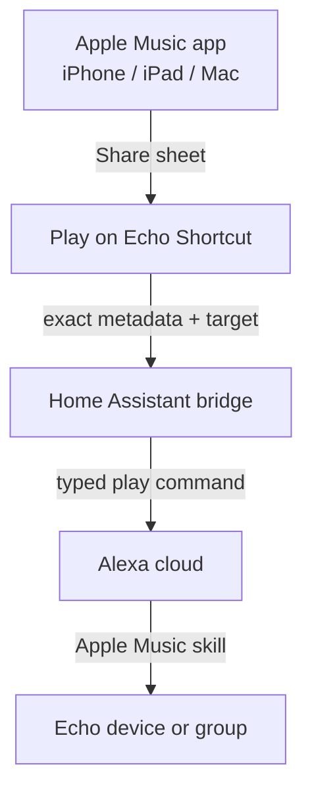

# Apple Music → Echo Bridge — Requirements

## Summary

A household "Play on Echo" bridge: browse in the native Apple Music app on iPhone, iPad, or Mac, share a track, album, or playlist to a Shortcut, pick an Echo device or Alexa speaker group, and Home Assistant sends Alexa the exact typed request so the right music starts playing.

---

## Problem Frame

Echo devices cannot receive Apple Music by casting — no AirPlay, no public "play this" API. The only working path today is the Apple Music skill on Alexa, controlled by voice or the Alexa app. Voice frequently mis-hears and selects the wrong song or playlist; the Alexa app's music search is unpleasant enough that browsing there isn't an option. The result: music discovery happens in Apple Music, but there is no way to hand what was found to the speakers that fill the house.

---

## Key Decisions

- **Precision remote, not casting.** The Apple Music skill on Alexa stays the playback engine; the build replaces the lossy voice channel with exact typed metadata. Fidelity ceiling is Alexa's text search — near-perfect for anything with a clean name.
- **Native Apple Music apps are the browse UI.** No custom browsing interface is built or maintained; the share sheet is the send affordance.
- **Home Assistant hosts the bridge.** The household already runs HA, and its community Alexa integration provides the command path to Echo devices.
- **iPhone/iPad are the primary surface.** The Mac path is accepted as rougher at first (macOS Music's share-to-Shortcuts is weaker).
- **Household tool, hacks welcome.** Unofficial APIs and occasional re-auth maintenance are accepted trade-offs; no multi-user or certification concerns.

---

## Requirements

**Playback and targeting**

- R1. From any household iPhone, iPad, or Mac, the user can send an Apple Music track, album, or playlist to a chosen Echo device or Alexa speaker group.
- R2. The selection travels as exact typed metadata (title, artist, playlist name), never as spoken audio.
- R3. Playback runs through the Apple Music skill on Alexa; Echos stream directly rather than relaying audio from the sending device.

**Entry points**

- R4. Primary entry point: Share sheet in the Apple Music app → "Play on Echo" → pick speaker or group → music starts.
- R5. A typed quick-command entry (Shortcut prompt or HA dashboard input) fires the same pipeline — the first milestone and a fallback when sharing isn't handy.
- R6. The speaker picker reflects the household's actual Echo devices and Alexa groups.

**Bridge and automation**

- R7. The Shortcut hands the request to Home Assistant, which issues the play command to Alexa.
- R8. The play action is callable from other Shortcuts and automations (e.g., a morning routine starts a playlist in the kitchen).
- R9. When a send fails (HA unreachable, Alexa auth expired), the sending device shows a visible failure rather than silence.

---

## Key Flows

- F1. Share-to-play
  - **Trigger:** User finds music in the Apple Music app.
  - **Steps:** Share → "Play on Echo" Shortcut → Shortcut extracts exact metadata from the share URL → user picks Echo or group → Shortcut calls HA → HA issues the typed play command to Alexa → the Apple Music skill starts playback on the target.
  - **Outcome:** Chosen music playing on the chosen speaker(s) within seconds.
  - **Covers:** R1–R4, R6, R7

- F2. Typed quick-command
  - **Trigger:** User knows what they want and invokes the quick-command entry.
  - **Steps:** Type request → pick target → same HA → Alexa pipeline as F1.
  - **Outcome:** Music playing; proves the pipeline end-to-end before the share-sheet layer exists.
  - **Covers:** R5, R7

- F3. Automation
  - **Trigger:** Another Shortcut or automation (time, arrival, scene) invokes the play action with preset music and target.
  - **Outcome:** Music starts with no interaction.
  - **Covers:** R8

---

## Acceptance Examples

- AE1. **Covers R1, R2.** Given a track shared from Apple Music on the iPad, when "Kitchen" is chosen, then that exact track plays on the Kitchen Echo.
- AE2. **Covers R1, R3.** Given an album sent to the "Everywhere" group, then all Echos in the group play it in sync via Alexa's native group playback.
- AE3. **Covers R1, R2.** Given one of the user's own Apple Music playlists shared by name, then that playlist starts (the playlist lives in the same Apple Music account linked to Alexa).
- AE4. **Covers R9.** Given HA is unreachable, when a send is attempted, then the Shortcut reports the failure on the sending device.

---

## Success Criteria

- The right music plays on the first try for the overwhelming majority of sends (>95% for tracks and albums with distinct names).
- Share tap to audible music in roughly 10 seconds or less.
- Maintenance stays household-scale: re-auth or repair measured in minutes, a few times a year.

---

## Scope Boundaries

**Deferred for later**

- Sonos-style web controller with browsing, queue, and now-playing (approach B from the brainstorm) — upgrade path if queue visibility is missed; the HA bridge built here is reused.
- Queue management, volume, and scrubbing from the sending device — voice and the Alexa app cover these after playback starts.
- A polished Mac entry point beyond whatever share/quick-command path works first.

**Outside this product's identity**

- A multi-user product for people outside the household — no official APIs, account linking, hosting, or Apple/Amazon program compliance.

---

## Dependencies / Assumptions

- Home Assistant server is running and reachable from household devices.
- Apple Music skill is linked to Alexa and Echo speaker groups are defined (both already in place).
- The Alexa Media Player community integration will be installed in HA — not yet present.
- Unverified assumption, check during planning: the HA integration can target Apple Music as the music provider for a play command; if not, the typed-text command channel is the fallback mechanism.
- The unofficial Alexa API dependency will occasionally break and need re-auth after Amazon-side changes — accepted.
- An active Apple Music subscription on the account linked to Alexa; personal playlists referenced by name must live in that account.

---

## Outstanding Questions

**Deferred to Planning**

- Which Alexa command mechanism HA uses (music-provider play call vs typed text command), pending verification of Apple Music provider support.
- How the Shortcut turns an Apple Music share URL into clean title/artist/playlist metadata.
- Where the speaker and group list lives and how it stays current as devices change.
- The exact Mac entry-point shape (Music share sheet, Services menu, or quick-command only).
