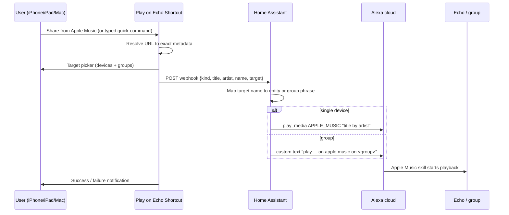
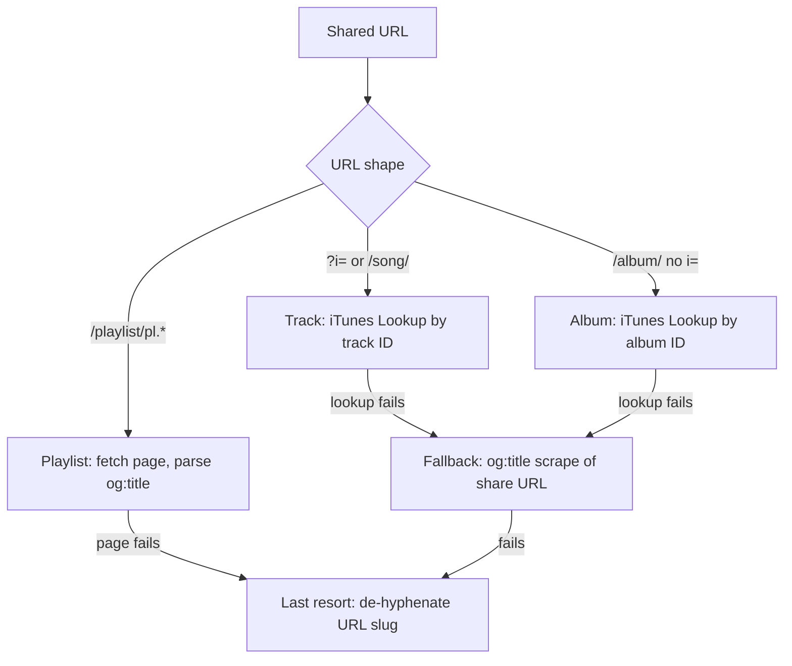

# feat: Apple Music → Echo "Play on Echo" bridge

## Summary

Build the household bridge as three cooperating artifacts: a Home Assistant package (webhook + play-router script) that commands Echos via the Alexa Media Player integration, a "Play on Echo" Shortcut that turns Apple Music share URLs into exact metadata, and a typed quick-command Shortcut that proves the pipeline first. This repo stores the versioned HA config and Shortcut build recipes; the HA server is the deployment target.

---

## Problem Frame

Echo devices accept no casting; the Apple Music skill on Alexa is the only playback engine, and its voice channel mis-selects music (see origin: docs/brainstorms/2026-07-05-apple-music-echo-bridge-requirements.md). Research confirmed the two command channels that replace voice with exact text — the Alexa Media Player integration's provider-typed play call (`Alexa.Music.PlaySearchPhrase` with `APPLE_MUSIC`) and the typed-text channel (`Alexa.TextCommand`, the type-to-Alexa pipeline) — and confirmed that share URLs resolve to exact metadata without any paid API.

---

## Requirements

Carried from origin (R-IDs preserved).

**Playback and targeting**

- R1. Send an Apple Music track, album, or playlist from any household iPhone, iPad, or Mac to a chosen Echo device or Alexa speaker group.
- R2. The selection travels as exact typed metadata, never spoken audio.
- R3. Playback runs through the Apple Music skill on Alexa; Echos stream directly.

**Entry points**

- R4. Primary entry: Apple Music share sheet → "Play on Echo" → pick target → music starts.
- R5. Typed quick-command entry fires the same pipeline (first milestone, and fallback).
- R6. The target picker reflects the household's actual Echo devices and Alexa groups.

**Bridge and automation**

- R7. The Shortcut hands the request to Home Assistant, which issues the play command to Alexa.
- R8. The play action is callable from other Shortcuts and automations.
- R9. Failed sends show a visible failure on the sending device.

---

## Key Technical Decisions

- **Alexa Media Player (HACS community integration) as the command bridge.** It is the only path with a provider-typed Apple Music play call, is actively maintained (v5.15.6, July 2026), and exposes Echo devices as entities. The official core "Alexa Devices" integration (`alexa_devices.send_text_command`, HA 2025.6+) is the documented fallback: core-maintained but text-command only. If the community integration breaks for an extended period, the router script swaps its two service calls for text commands — no Shortcut changes.
- **Two-channel command routing.** Single device: `media_player.play_media` with `media_content_type: APPLE_MUSIC` and a `"<title> by <artist>"` search phrase. Group: `media_content_type: custom` text command (`"play <phrase> on apple music on <group name>"`) — direct playback to group entities is not supported, and the text channel is the literal spoken-command pipeline, so group behavior matches a perfectly-heard voice request.
- **Target list is canonical in Home Assistant.** The Shortcut sends a friendly target name (`"kitchen"`, `"everywhere"`); an HA mapping resolves it to an entity or group phrase. Device changes are edited once, in HA.
- **Metadata resolution ladder.** iTunes Lookup API (keyless, `itunes.apple.com/lookup?id=`) for tracks and albums → og:title scrape of the share URL for playlists (works for personal `pl.u-` links; verified) and as universal fallback → de-hyphenated URL slug as last resort. No Apple Developer membership needed.
- **Webhook with secret ID as the Shortcut→HA transport.** Long random `webhook_id` is the credential, `allowed_methods: [POST]`, `local_only: true` initially. If sends from cellular are wanted later, switch to the Nabu Casa webhook URL rather than exposing HA directly.
- **Repo stores buildable artifacts, not binaries.** HA YAML is versioned directly; Shortcuts are not text files, so each ships as a step-by-step build recipe in docs (plus an exported `.shortcut` file if convenient).

---

## High-Level Technical Design

Send path (both entry points converge at the webhook):

Metadata resolution ladder in the Shortcut:

---

## Implementation Units

### U1. Alexa Media Player foundation in Home Assistant

- **Goal:** Working command channel from HA to every Echo, with the risky unknowns tested before anything is built on top.
- **Requirements:** R3, R6 groundwork.
- **Dependencies:** none.
- **Files:** `docs/setup.md` (auth setup notes, entity inventory).
- **Approach:** Install Alexa Media Player via HACS; complete login with the mandatory authenticator-app 2FA (52-char app key from the Amazon approval settings page). Verify every Echo appears as a `media_player` entity. Then run the two probe tests from Developer Tools: (a) `play_media` with `APPLE_MUSIC` and a known track phrase against one Echo; (b) the undocumented combination — group playback phrasing for Apple Music — via both the `APPLE_MUSIC` provider call with an "in <group> group" suffix and the `custom` text command. Record which group phrasing works in `docs/setup.md`; U2's router uses the winner.
- **Test scenarios:**
  - Covers AE1 groundwork. `play_media` `APPLE_MUSIC` with "<known track> by <artist>" on one Echo → that exact track plays.
  - Group probe: text command "play <album> on apple music on <group name>" → all group members play in sync.
  - Negative probe: nonsense phrase → observe Alexa's failure behavior (informs U2 feedback design).
- **Verification:** Both channels demonstrated from HA Developer Tools; group phrasing decision recorded.

### U2. Webhook and play-router package in Home Assistant

- **Goal:** One HTTP endpoint that accepts the payload contract and routes to the right Echo via the right channel.
- **Requirements:** R2, R3, R6, R7.
- **Dependencies:** U1.
- **Files:** `home_assistant/packages/play_on_echo.yaml` (webhook automation, router script, target map), `docs/setup.md` (install steps).
- **Approach:** Webhook trigger (`allowed_methods: [POST]`, `local_only: true`) receiving `{kind: track|album|playlist|freeform, title, artist, name, target}`. A target dictionary maps friendly names to either a `media_player` entity (single device) or a group name (routes to the text-command channel per U1's finding). Phrase templates per kind (track: "<title> by <artist>"; album: "the album <title> by <artist>"; playlist: "the playlist <name>"; exact wording tuned during implementation). Unknown target or malformed payload → fire a companion-app notification naming the problem rather than silently dropping.
- **Test scenarios:**
  - Covers AE1. POST a track payload targeting one Echo → track plays there.
  - Covers AE2. POST an album payload targeting a group → group plays in sync.
  - Covers AE3. POST a playlist payload with a personal playlist name → playlist starts.
  - Unknown target name → error notification, no play attempt.
  - Missing fields (no artist on a track payload) → phrase degrades gracefully (title only).
- **Verification:** All payload kinds play on both a single Echo and a group using only `curl`-style POSTs; failure cases notify.

### U3. Typed quick-command Shortcut (first milestone)

- **Goal:** End-to-end proof: type what you want, pick a target, music plays. This is the origin's milestone-1 fallback entry.
- **Requirements:** R5, R7, R9.
- **Dependencies:** U2.
- **Files:** `shortcuts/quick-command.md` (build recipe).
- **Approach:** Prompt for text → choose target from a static list matching U2's target map → POST `{kind: freeform, title: <text>, target}` → show success notification; a failed request surfaces Shortcuts' own error alert. Runs on iPhone, iPad, and Mac unchanged.
- **Test scenarios:**
  - Covers AE4. HA unreachable → Shortcut shows a visible failure.
  - Typed "album Rumours by Fleetwood Mac" to Kitchen → plays.
- **Verification:** Music playing within ~10 seconds of submitting the prompt (origin success criterion).

### U4. Share-sheet "Play on Echo" Shortcut

- **Goal:** The primary experience — share from Apple Music, pick a speaker, exact music plays.
- **Requirements:** R1, R2, R4, R6, R9.
- **Dependencies:** U2 (U3 recommended first as pipeline proof).
- **Files:** `shortcuts/play-on-echo.md` (build recipe), `docs/setup.md` (share-sheet enablement).
- **Approach:** Share-sheet Shortcut accepting **URLs** (not "Media" — that type never matches Music shares). Parse per the resolution ladder: `?i=`/`/song/` → track ID → iTunes Lookup (`trackName`, `artistName`); `/album/<slug>/<digits>` → album ID → Lookup (`collectionName`, `artistName`); `/playlist/.../pl.*` → fetch page, parse `og:title` ("<name> by <owner> on Apple Music", owner segment absent for editorial playlists). Follow redirects before parsing (handles `geo.music.apple.com`, storefront-less, and legacy `itunes.apple.com` links); extract IDs by regex, never by splitting on `?`. Build the POST body with the Dictionary action (titles contain quotes and brackets). Target picker, POST, notify — same tail as U3.
- **Test scenarios:**
  - Covers AE1. Share a track (URL with `?i=`) → exact track title + artist reach HA; track plays on the chosen Echo.
  - Covers AE2. Share an album to a group target → album plays in sync.
  - Covers AE3. Share a personal playlist (`pl.u-` link) → og:title parse yields the playlist name; playlist plays.
  - Editorial/catalog playlist (`pl.` link, no "by <owner>") → name parses correctly.
  - Non-US storefront URL and storefront-less URL → both resolve after redirect.
  - iTunes Lookup unreachable → og:title fallback still produces title + artist.
  - Covers AE4. HA webhook unreachable → visible failure on the sending device.
- **Verification:** All three content types shared from an iPhone play correctly; fallback path demonstrated by pointing Lookup at an invalid host once.

### U5. macOS enablement and automation surface

- **Goal:** Same Shortcut working from the Mac's Music app, and the play action callable from other automations.
- **Requirements:** R1 (Mac leg), R8.
- **Dependencies:** U4.
- **Files:** `docs/setup.md` (macOS steps), `shortcuts/play-on-echo.md` (automation-input notes).
- **Approach:** macOS Music shares the same music.apple.com URL, so no logic changes: enable "Use as Quick Action"/"Show in Share Sheet" on the Shortcut and turn on the Shortcuts extension in System Settings → Extensions (it does not appear until this is done — document it). For automation (R8): accept optional preset parameters (payload + target) so other Shortcuts and personal automations can invoke it without prompts, e.g. a morning routine starting a playlist in the kitchen.
- **Test scenarios:**
  - Share a track from macOS Music → plays on the chosen Echo.
  - A second Shortcut invokes Play on Echo with preset playlist + target → plays with zero prompts.
- **Verification:** Both scenarios demonstrated; setup doc reproduces the macOS enablement from scratch.

---

## Scope Boundaries

Carried from origin:

**Deferred for later**

- Sonos-style web controller with browsing, queue, and now-playing — the HA bridge built here is its reuse layer.
- Queue management, volume, scrubbing from the sending device — voice and the Alexa app cover post-start control.

**Outside this product's identity**

- Multi-user product for people outside the household — no official APIs, account linking, hosting, or certification.

**Deferred to Follow-Up Work**

- "Send what's playing" companion Shortcut (`Get Current Song` → metadata with zero network calls) — cheap add once U2 exists, not needed for v1.
- Migration to the core "Alexa Devices" integration if the community integration's maintenance burden grows.

---

## Risks & Dependencies

- **Unofficial Alexa API breakage.** Login/setup breaks every 1–2 months as Amazon changes things; fixes historically land within days. Accepted in origin. Mitigations: authenticator-app auto-OTP re-login; documented core-integration fallback (text-command channel covers the whole use case).
- **Fuzzy search matching.** Commands send search phrases, not catalog IDs — Alexa may pick a different remaster or version for ambiguous names. Accepted fidelity ceiling per origin; exact metadata from the Lookup API minimizes it.
- **Apple Music + group phrasing is undocumented.** U1 probes it first; the `custom` text channel is the guaranteed-equivalent fallback since it is the spoken-command pipeline.
- **Amazon account credentials live in HA config** (integration requirement). Household-acceptable; noted in setup doc.
- **Remote sends need exposure decisions.** `local_only: true` covers home Wi-Fi; cellular sends require the Nabu Casa webhook URL — deferred until wanted.

---

## Sources & Research

- Alexa Media Player: provider list incl. `APPLE_MUSIC` (integration wiki); `play_music` → `Alexa.Music.PlaySearchPhrase` and `run_custom` → `Alexa.TextCommand` (alexapy source); group workaround and TTS group limits (wiki); auth/2FA requirements and breakage cadence (wiki Configuration, issue tracker 2025-2026).
- Core alternative: `alexa_devices.send_text_command`, HA 2025.6+ (home-assistant.io/integrations/alexa_devices).
- Apple Music URLs: `?i=` track discriminator (Apple Developer Forums); iTunes Lookup keyless API (Apple archive docs, verified live 2026-07-05); personal-playlist og:title fetchability (verified live 2026-07-05); share-sheet input types and macOS Quick Action enablement (Apple Support).
- HA webhook trigger pattern (home-assistant.io automation trigger docs).
